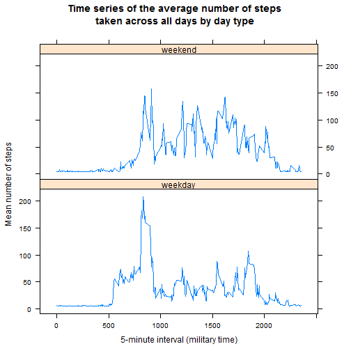

#Reproducible Research: Peer Assessment 1

##Introduction

It is now possible to collect a large amount of data about personal movement using activity monitoring devices such as a Fitbit, Nike Fuelband, or Jawbone Up. These type of devices are part of the ‚<U+0080><U+009C>quantified self‚<U+0080>ù movement ‚<U+0080><U+0093> a group of enthusiasts who take measurements about themselves regularly to improve their health, to find patterns in their behavior, or because they are tech geeks. But these data remain under-utilized both because the raw data are hard to obtain and there is a lack of statistical methods and software for processing and interpreting the data.

This assignment makes use of data from a personal activity monitoring device. This device collects data at 5 minute intervals through out the day. The data consists of two months of data from an anonymous individual collected during the months of October and November, 2012 and include the number of steps taken in 5 minute intervals each day.

##Data

The variables included in this dataset are:

- steps: Number of steps taking in a 5-minute interval (missing values are coded as NA)
- date: The date on which the measurement was taken in YYYY-MM-DD format
- interval: Identifier for the 5-minute interval in which measurement was taken

The dataset is stored in a comma-separated-value (CSV) file and there are a total of 17,568 observations in this dataset.   

###Loading and preprocessing the data

```r
#load data
activity <- read.csv("D://R/activity.csv", colClasses = c("numeric", "character", "numeric"))

#convert date column to date data type
activity$date <- as.Date(activity$date)
head(activity)
```

```
##   steps       date interval
## 1    NA 2012-10-01        0
## 2    NA 2012-10-01        5
## 3    NA 2012-10-01       10
## 4    NA 2012-10-01       15
## 5    NA 2012-10-01       20
## 6    NA 2012-10-01       25
```
   
###What is the mean total number of steps taken per day?
For this part of the assignment, you can ignore the missing values in the dataset.

**1. Calculate the total number of steps taken per day**

```r
#calculate sum of daily steps
daily.steps <- rowsum(activity$steps, format(activity$date, "%Y-%m-%d"), na.rm=TRUE)
daily.steps <- data.frame(daily.steps)
names(daily.steps) <- ("steps") #name column of data frame
head(daily.steps)
```

```
##            steps
## 2012-10-01     0
## 2012-10-02   126
## 2012-10-03 11352
## 2012-10-04 12116
## 2012-10-05 13294
## 2012-10-06 15420
```


**2. If you do not understand the difference between a histogram and a barplot, research the difference between them. Make a histogram of the total number of steps taken each day**

```r
#create histogram of total daily steps
hist(daily.steps$steps, 
     breaks = seq(from=0, to=25000, by=2500), 
     ylim = c(0,20), 
     col="forestgreen", 
     xlab = "Total number of daily steps", 
     main = "Total Number of Steps Taken Each Day\n(NA removed)")
```

 


**3. Calculate and report the mean and median of the total number of steps taken per day**

```r
options(scipen=999) #prevent scientific notation
mean <- round(mean(daily.steps$steps),1)
median <- (median(daily.steps$steps))
```
The mean total number of steps taken per day is **9354.2** and the median total number of steps taken per day is **10395**.    
   
###What is the average daily activity pattern?
**1. Make a time series plot (i.e. type = "l") of the 5-minute interval (x-axis) and the average number of steps taken, averaged across all days (y-axis)**

```r
#calculate mean of steps by 5-minute interval and create new dataset
time_series <- tapply(activity$steps, activity$interval, mean, na.rm=TRUE)
head(time_series)
```

```
##         0         5        10        15        20        25 
## 1.7169811 0.3396226 0.1320755 0.1509434 0.0754717 2.0943396
```

```r
#create time-series plot
plot(row.names(time_series), 
     time_series, 
     type="l", 
     lwd=2, #widen line
     col = "forestgreen",
     xlab = "5-minute interval (military time)", 
     ylab = "Mean number of steps", 
     main = "Time series of the average number of steps\ntaken across all days (NA removed)")
```

 


**2. Which 5-minute interval, on average across all the days in the dataset, contains the maximum number of steps?**

```r
#find interval with maximum mean daily steps
max_interval <- which.max(time_series)
max <- names(max_interval)
```
The 5-minute interval containing the maximum number of steps is **835**.


###Imputing missing values
Note that there are a number of days/intervals where there are missing values (coded as NA). The presence of missing days may introduce bias into some calculations or summaries of the data.

**1. Calculate and report the total number of missing values in the dataset (i.e. the total number of rows with NAs)**

```r
activity_NA <- sum(is.na(activity))
```
The total number of missing values in the dataset is **2304**.


**2. Devise a strategy for filling in all of the missing values in the dataset. The strategy does not need to be sophisticated. For example, you could use the mean/median for that day, or the mean for that 5-minute interval, etc.**

```r
#create vector of daily mean number of steps to replace NA's
na_loc <- which(is.na(activity$steps))
means <- rep(mean(activity$steps, na.rm=TRUE), times=length(na_loc))
head(means)
```

```
## [1] 37.3826 37.3826 37.3826 37.3826 37.3826 37.3826
```


**3. Create a new dataset that is equal to the original dataset but with the missing data filled in.**

```r
#replace NA's in original data set with daily mean 
activity[na_loc, "steps"] <- means
head(activity)
```

```
##     steps       date interval
## 1 37.3826 2012-10-01        0
## 2 37.3826 2012-10-01        5
## 3 37.3826 2012-10-01       10
## 4 37.3826 2012-10-01       15
## 5 37.3826 2012-10-01       20
## 6 37.3826 2012-10-01       25
```


**4. Make a histogram of the total number of steps taken each day...**

```r
#calculate total daily steps
sum.steps <- aggregate(activity$steps, by=list(activity$date), FUN=sum)
names(sum.steps) <- c("date", "total.steps")
#create histogram of total daily steps
hist(sum.steps$total.steps, 
     breaks = seq(from=0, to=25000, by=2500), 
     ylim = c(0,30), 
     col="forestgreen", 
     xlab = "Total number of steps", 
     main = "Total Number of Steps Taken Each Day\n(NA replaced by daily mean)")
```

 

**...and calculate and report the mean and median total number of steps taken per day. Do these values differ from the estimates from the first part of the assignment? What is the impact of imputing missing data on the estimates of the total daily number of steps?**

```r
options(scipen=999) #prevent scientific notation
mean2 <- round(mean(sum.steps$total.steps),1)
median2 <- round(median(sum.steps$total.steps))
```
The mean total number of steps taken per day is **10766.2** and the median total number of steps taken per day is **10766**. By imputing missing data on the estimates of the total daily number of steps, the total number of data points (i.e., teh frequency) is increased (by 2304). The mean is significantly increased from 9354.2 to 10766 because we used the daily mean number of steps (37.4) to replace every NA. The median also increases from 10395 to 10766. The distribution (shape) of the data remains similar.


###Are there differences in activity patterns between weekdays and weekends?
For this part the weekdays() function may be of some help here. Use the dataset with the filled-in missing values for this part.

**1. Create a new factor variable in the dataset with two levels ‚<U+0080><U+0093> ‚<U+0080><U+009C>weekday‚<U+0080>ù and ‚<U+0080><U+009C>weekend‚<U+0080>ù indicating whether a given date is a weekday or weekend day.**

```r
#create new variable for weekdays vs. weekends
weekdays <- c("Monday", "Tuesday", "Wednesday", "Thursday", "Friday")
activity$daytype <- as.factor(ifelse(is.element(weekdays(as.Date(activity$date)),weekdays), "weekday", "weekend"))
head(activity)
```

```
##     steps       date interval daytype
## 1 37.3826 2012-10-01        0 weekday
## 2 37.3826 2012-10-01        5 weekday
## 3 37.3826 2012-10-01       10 weekday
## 4 37.3826 2012-10-01       15 weekday
## 5 37.3826 2012-10-01       20 weekday
## 6 37.3826 2012-10-01       25 weekday
```


**2. Make a panel plot containing a time series plot (i.e. type = "l") of the 5-minute interval (x-axis) and the average number of steps taken, averaged across all weekday days or weekend days (y-axis). See the README file in the GitHub repository to see an example of what this plot should look like using simulated data.**

```r
library(lattice)
#calculate average number of steps across all weekdays or weekends
mean_days <- aggregate(activity$steps, by=list(activity$daytype, activity$interval), mean)
names(mean_days) <- c("daytype", "interval", "mean")
#create panel plot
xyplot(mean ~ interval | daytype, mean_days,
       type = "l",
       lwd = 1,
       xlab = "5-minute interval (military time)",
       ylab = "Mean number of steps",
       layout = c(1,2),
       main = "Time series of the average number of steps\ntaken across all days by day type")
```

 

There is more activity during the weekend days than during the weekdays.

##Conclusion
This assignment provided a  step-by-step approach for analyzing data, including data laoding, data transformation, dealing with missing data, reporting statistcal data, and plotting the results. The reader should be able to follow this document to reproduce the resutls. This document was created with R version 3.2.0
